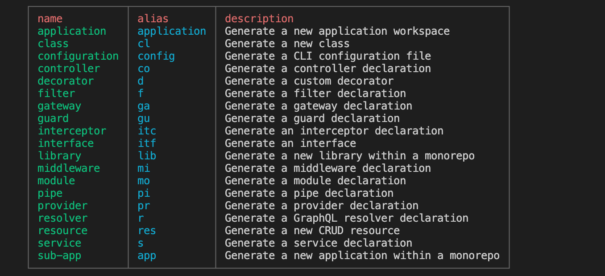
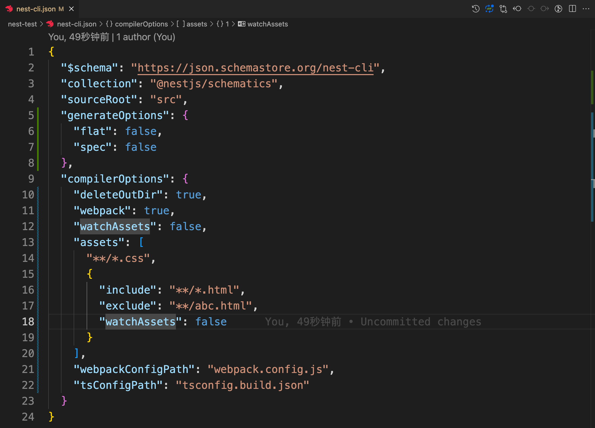

## Nest CLI 的使用

### 安装

```shell
npm install -g @nestjs/cli
```


### 创建项目

然后使用 nest-cli 创建项目

```shell
nest new 项目名
```


当然，也可以不安装 nest-cli，直接使用 npx 命令创建项目

```shell
npx nest new 项目名
```


### 创建代码块

可以通过 nest generate 生成各种代码块

具体可以通过 `nest generate --help` 查看




例如：

```shell
nest generate resource users
```

生成一整个 users 模块


```shell
nest generate application
```

生成整个项目结构，其实 nest new 的底层就是 nest generate application，只不过 nest new 额外做了 git init 和 npm install 等处理。


### 构建build

```shell
nest build
```

会在 dist 目录下生成编译后的代码


--wepback 和 --tsc 是指定用什么编译，默认是 tsc 编译，也可以切换成 webpack

- webpack 会做打包
- tsc 不做打包

node 模块本来就不需要打包，但是打包成单模块据说能提升加载的性能


--watch 是监听文件变动，自动 build 的

但是 --watch 默认只是监听 ts、js 文件，加上 --watchAssets 会连别的文件一同监听变化，并输出到 dist 目录，比如 md、yml 等文件


其实这些命令行命令，都可以在 `nest-cli.json` 中进行配置



详细的配置解析，可以通过如下地址查看：https://json.schemastore.org/nest-cli


### 总结

- nest new 快速创建项目
- nest generate 快速生成各种代码
- nest build 使用 tsc 或者 webpack 构建代码
- nest start 启动开发服务，支持 watch 和调试
- nest info 打印 node、npm、nest 包的依赖版本
