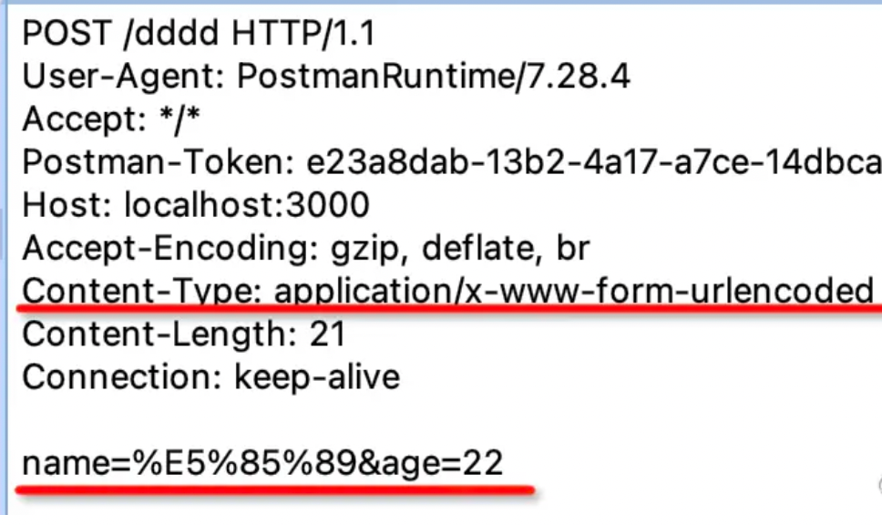
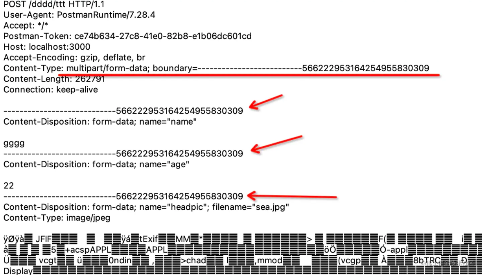
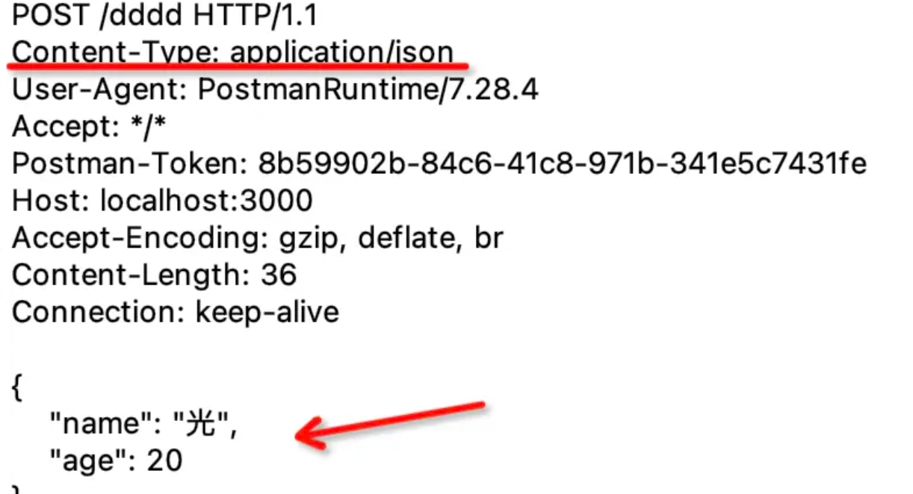

## HTTP 数据传输格式


### 数据传输格式

通常，http 传输数据的方式主要有：

- url param
- query
- form-urlencoded
- form-data
- json


#### url params

即参数再 url 中，如下：

```javascript
http://baidu.com/detail/1206
```

这里的 1206 就是路径中的参数（url param），服务端框架或者单页应用的路由都支持从 url 中取出参数。


#### query

通过 url 中 ？后面的用 & 分隔的字符串传递数据

```javascript
http://baidu.com/detail?id=1206
```

这里 id 就是 query 传递的数据


#### form-urlencoded

直接用 form 表单提交数据就是这种，它和 query 字符串的方式的区别只是放在了 body 里，然后指定下 content-type 是 `application/x-www-form-urlencoded`。



get 是把数据拼成 query 字符串放在 url 后面，于是表单的 post 提交方式的时候就直接用相同的方式把数据放在了 body 里。

通过 & 分隔的 form-urlencoded 的方式需要对内容做 url encode（比如使用 qs 转换），如果传递大量的数据，比如上传文件的时候就不是很合适，因为文件 encode 一遍的话太慢了，这时就可以用 form-data。


#### form-data

form data 不再是通过 & 分隔数据，而是用 --------- + 一串数字做为 boundary 分隔符。因为不是 url 的方式，所以不用再做 url encode。




form-data 需要指定 content type 为 `multipart/form-data`，然后指定 boundary 也就是分割线。body 里面就是用 boundary 分隔符分割的内容。

优缺点：

- 优点：这种方式适合传输文件，而且可以传输多个文件
- 缺点：多了只是用来分隔的 boundary，请求体会增大


#### json

form-urlencoded 需要对内容做 url encode，而 form data 需要加很长的 boundary，两种方式都有一些缺点。如果只是传输 json 数据的话，不需要用这两种。可以直接指定content type 为 application/json：




### 演示代码

```typescript
import { Controller, Get, Post, Query, Body, Param, HttpCode, UseInterceptors, UploadedFiles } from '@nestjs/common';
import { AnyFilesInterceptor } from '@nestjs/platform-express'
import { UsersService } from './users.service';
import { CreateUserDto } from './dto/create-user.dto';

@Controller('users')
export class UsersController {
  constructor(private readonly usersService: UsersService) {}

  // query 方式，通过 @Query 的装饰器取出来
  // 需要注意：这个 find 的路由要放到 :id 的路由前面
  // 因为 Nest 是从上往下匹配的，如果放在后面，会匹配到 :id 的路由
  @Get('find')
  find(@Query('name') name: string, @Query('age') age: string) {
    return this.usersService.find(name, age);
  }

  // url params 方式，通过 @Param 的装饰器取出来
  @Get(':id')
  findOne(@Param('id') id: string) {
    return this.usersService.findOne(+id);
  }

  // form urlencoded 和 json 都是从 body 取值
  // Nest 内部会根据 content type 做区分，使用不同的解析方式
  @Post()
  @HttpCode(200)
  create(@Body() createUserDto: CreateUserDto) {
    return this.usersService.create(createUserDto);
  }

  // Nest 解析 form data 使用 FilesInterceptor 的拦截器
  // 用 @UseInterceptors 装饰器启用，然后通过 @UploadedFiles 来取
  // 非文件的内容，同样是通过 @Body 来取。
  @Post('uploadfile')
  @UseInterceptors(AnyFilesInterceptor({
    dest: 'uploads/'
  }))
  uploadFile(@Body() createUserDto: CreateUserDto, @UploadedFiles() files: Express.Multer.File[]) {
    console.log(files);
    return `${JSON.stringify(createUserDto)}`
  }
}
```


### NestJS 内置状态码

Nest 中定义的状态码如下（部分）：

```typescript
enum HttpStatus {
    OK = 200, //成功响应
    CREATED = 201, // 该请求已成功，并因此创建了一个新的资源。这通常是在POST请求，或是某些PUT请求之后返回的响应。
    ACCEPTED = 202,// 请求已经接收到，但还未响应，没有结果
    PARTIAL_CONTENT = 206, // 服务器已经成功处理了部分 GET 请求。类似于 FlashGet 或者迅雷这类的 HTTP 下载工具都是使用此类响应实现断点续传或者将一个大文档分解为多个下载段同时下载。该请求必须包含 Range 头信息来指示客户端希望得到的内容范围，并且可能包含 If-Range 来作为请求条件。
    AMBIGUOUS = 300, // 被请求的资源有一系列可供选择的回馈信息，每个都有自己特定的地址和浏览器驱动的商议信息。用户或浏览器能够自行选择一个首选的地址进行重定向。
    MOVED_PERMANENTLY = 301, //被请求的资源已永久移动到新位置，并且将来任何对此资源的引用都应该使用本响应返回的若干个 URI 之一
    FOUND = 302,// 请求的资源现在临时从不同的 URI 响应请求。
    SEE_OTHER = 303,// 对应当前请求的响应可以在另一个 URI 上被找到，而且客户端应当采用 GET 的方式访问那个资源。
    NOT_MODIFIED = 304, // 如果客户端发送了一个带条件的 GET 请求且该请求已被允许，而文档的内容（自上次访问以来或者根据请求的条件）并没有改变，则服务器应当返回这个状态码。
    BAD_REQUEST = 400, // 语义有误，当前请求无法被服务器理解；请求参数有误。
    UNAUTHORIZED = 401,// 当前请求需要用户验证。
    FORBIDDEN = 403,// 服务器已经理解请求，但是拒绝执行它。
    NOT_FOUND = 404,// 请求失败，请求所希望得到的资源未被在服务器上发现。
    METHOD_NOT_ALLOWED = 405,// 请求行中指定的请求方法不能被用于请求相应的资源
    PROXY_AUTHENTICATION_REQUIRED = 407, //与401响应类似，只不过客户端必须在代理服务器上进行身份验证。
    REQUEST_TIMEOUT = 408,// 请求超时
    CONFLICT = 409,// 由于和被请求的资源的当前状态之间存在冲突，请求无法完成。
    INTERNAL_SERVER_ERROR = 500, // 服务器遇到了不知道如何处理的情况。
    NOT_IMPLEMENTED = 501,// 此请求方法不被服务器支持且无法被处理。
    BAD_GATEWAY = 502,// 此错误响应表明服务器作为网关需要得到一个处理这个请求的响应，但是得到一个错误的响应。
    SERVICE_UNAVAILABLE = 503,// 服务器没有准备好处理请求。 
    GATEWAY_TIMEOUT = 504,// 当服务器作为网关，不能及时得到响应时返回此错误代码。
    HTTP_VERSION_NOT_SUPPORTED = 505 // 服务器不支持请求中所使用的HTTP协议版本。
}
```


### 总结：

其中前两种是 url 中的：

- **url param**： url 中的参数，Nest 中使用 @Param 来取
- **query**：url 中 ? 后的字符串，Nest 中使用 @Query 来取

后三种是 body 中的：

- **form urlencoded**： 类似 query 字符串，只不过是放在 body 中。Nest 中使用 @Body 来取，axios 中需要指定 content type 为 `application/x-www-form-urlencoded`，并且对数据用 qs 或者 query-string 库做 url encode
- **json**： json 格式的数据。Nest 中使用 @Body 来取，axios 中不需要单独指定 content type，axios 内部会处理。
- **form data**：通过 ----- 作为 boundary 分隔的数据。主要用于传输文件，Nest 中要使用 FilesInterceptor 来处理其中的 binary 字段，用 @UseInterceptors 来启用，其余字段用 @Body 来取。axios 中需要指定 content type 为 `multipart/form-data`，并且用 FormData 对象来封装传输的内容。

这 5 种 http 的传输数据的方式覆盖了绝大多数开发场景，如果你想进阶全栈，能够提供这 5 种接口是首先要做到的。


