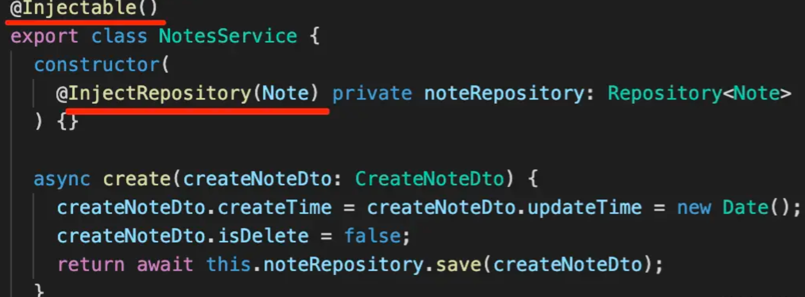
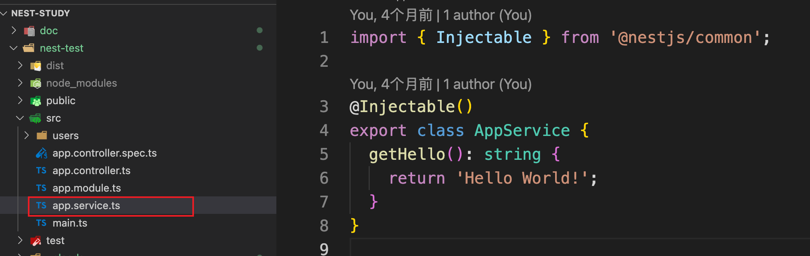
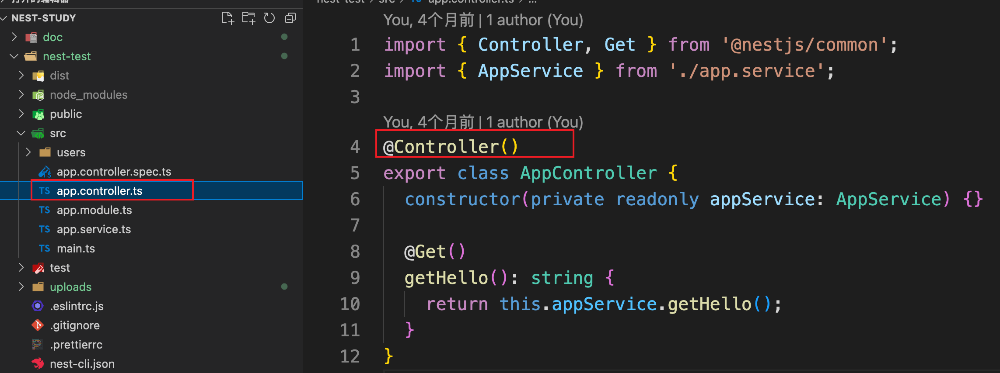
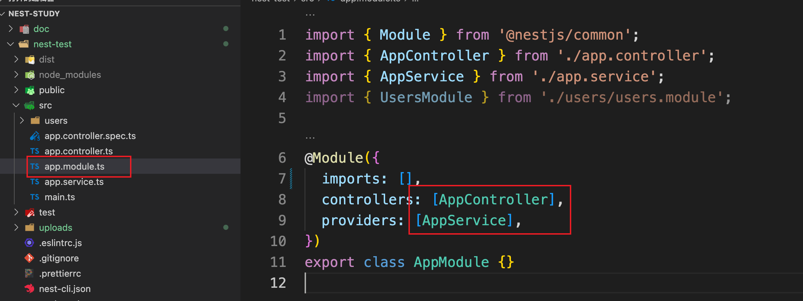
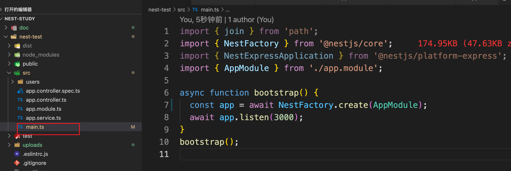
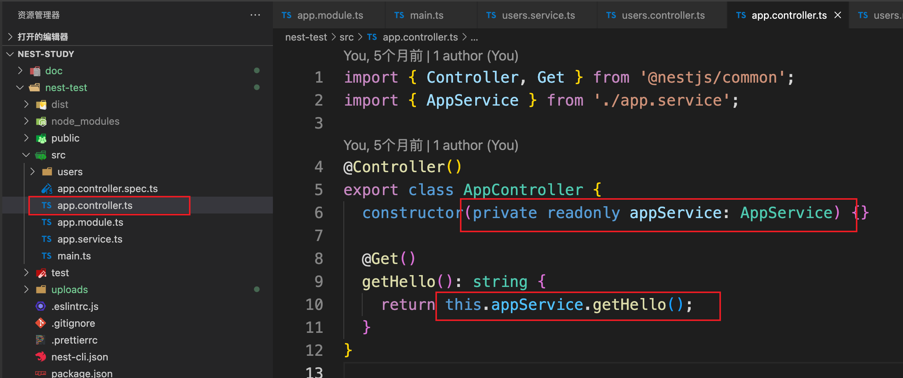
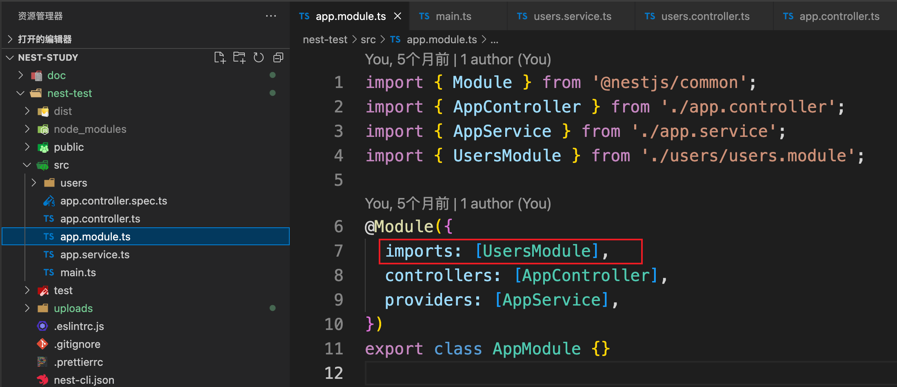
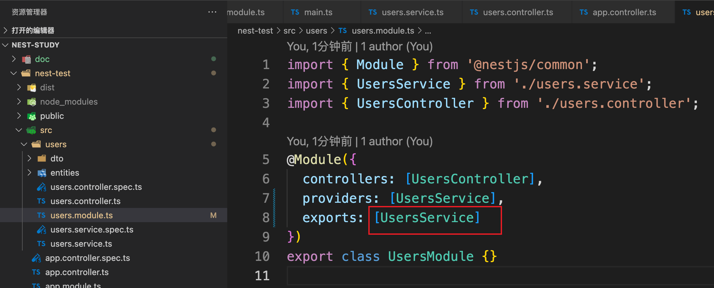

## IOC

### 什么是 IOC

在后端系统中，一般会有很多对象：

- Controller 对象：接收 http 请求，调用 Service，返回响应
- Service 对象：实现业务逻辑
- Repository 对象：实现对数据库的增删改查

除了上面的，可能还有数据库链接对象 DataSource，配置对象 Config 等等


而这些对象关系错综复杂：

Controller 依赖了 Service 实现业务逻辑，Service 依赖了 Repository 来做增删改查，Repository 依赖 DataSource 来建立连接，DataSource 又需要从 Config 对象拿到用户名密码等信息


这就导致了，创建这些对象特别复杂，需要理清它们之间的依赖关系以及先后顺序，如：

```js
const config = new Config({ username: 'xxx', password: 'xxx'});

const dataSource = new DataSource(config);

const repository = new Repository(dataSource);

const service = new Service(repository);

const controller = new Controller(service);
```

经过了一系列的初始化，才可以进行业务代码编写

而且像 config、dataSource、repository、service、controller 等这些对象不需要每次都 new 一个新的，一直用一个就可以，也就是保持单例。在应用初始化的时候，需要理清依赖的先后关系，创建一大堆对象组合起来，还要保证不要多次 new，这就很麻烦。这也是后端系统都有的痛点问题


而 IOC( Inverse Of Control) 就是用来解决这个问题的。java 的 spring 也实现了 IOC


IOC( Inverse Of Control)：反转控制，顾名思义，本来是手动 new 依赖对象，然后组装起来，现在变成声明依赖了啥，等待被注入。

例如：在 class 上声明依赖了啥，然后让工具去分析声明的依赖关系，根据先后顺序自动把对象创建好了，再组装起来


### Nestjs 的 IOC



比如上面就是声明这个 class 要放到 IOC 容器里，然后它的依赖是啥


下面来看下 Nestjs 的 IOC：



有一个 AppService 声明了 @Injectable，代表这个 class 可注入，那么 nest 就会把它的对象放到 IOC 容器里。




AppController 声明了 @Controller，代表这个 class 可以被注入，nest 也会把它放到 IOC 容器里。


为什么 Controller 是单独的装饰器呢？

- 因为 Service 是可以被注入也是可以注入到别的对象的，所以用 @Injectable 声明
- 而 Controller 只需要被注入，所以 nest 单独给它加了 @Controller 的装饰器


然后在 AppModule 里引入



通过 @Module 声明模块，其中 controllers 是控制器，只能被注入。providers 里可以被注入，也可以注入别的对象，比如这里的 AppService。


然后在入口模块跑起来，那么 nest 就会从 AppModule 开始解析 class 上通过装饰器声明的依赖信息，自动创建和组装对象




所以 AppController 只是声明了对 AppService 的依赖，就可以调用它的方法了。nest 在背后自动做了对象创建和依赖注入的工作




nest 还添加了模块机制，可以把不同业务的 controller、service 等放到不同模块里。

1、在 AppModule 引入了 UserModule



2、在 UserModule 导出了 UsersService



那么 AppModule 中就可以使用 UsersService 来注入了


这就是 Nest 的 IOC 机制


### 总结

- 后端系统有很多的对象，这些对象之间的关系错综复杂，如果手动创建并组装对象比较麻烦，所以后端框架一般都提供了 IOC 机制。

- IOC 机制是在 class 上标识哪些是可以被注入的，它的依赖是什么，然后从入口开始扫描这些对象和依赖，自动创建和组装对象。

- Nest 里通过 @Controller 声明可以被注入的 controller，通过 @Injectable 声明可以被注入也可以注入别的对象的 service，然后在 @Module 声明的模块里引入。

- 并且 Nest 还提供了 Module 和 Module 之间的 import，可以引入别的模块的 provider 来注入。

- 虽然 Nest 这套实现了 IOC 的模块机制看起来繁琐，但是却解决了后端系统的对象依赖关系错综复杂的痛点问题。


