## Nest 的调试


### Node 调试

在学 Nest 调试之前,先看下 Node 调试

如下，有一段代码：

```js
const os = require('os')

const arch = os.arch()

console.log(arch)
```

通过 os 获取 CPU 架构，直接使用 node 执行，可以得到：

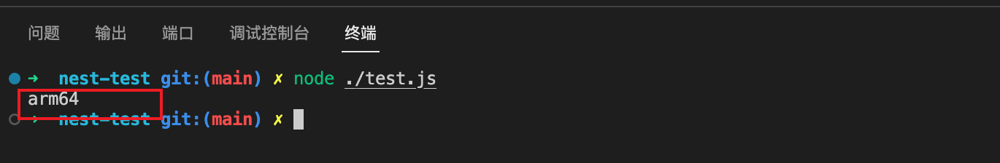


node 提供了调试模式运行：

- node --inspect：调试模式运行
- node --inspect-brk：调试模式运行，并在首行断点


这里使用：

```shell
node --inspect-brk ./test.js
```

可以看到，这是启动了一个 ws 服务

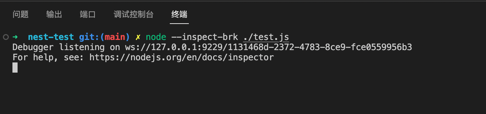


然后打开 [chrome://inspect/](https://link.juejin.cn/?target=)，可以看到可以调试的目标：

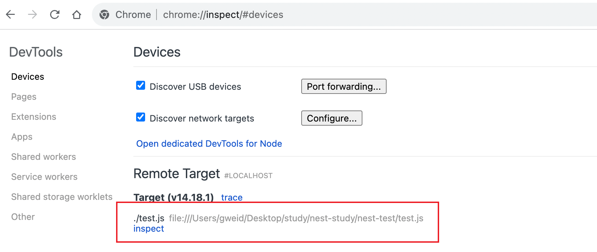


如果没看到 inspect，配置下 network targets，加上：加上 localhost:9229

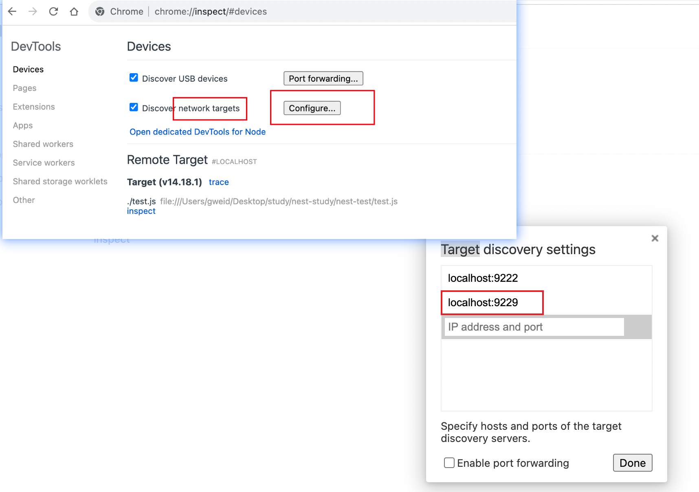


然后点击 inspect 即可看到调试界面

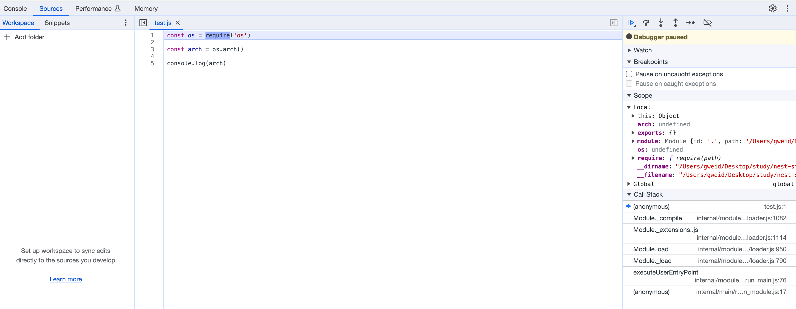


nest 也是 node 项目，也可以 通过这种方式来调试，但是 nest 提供了 debug 命令

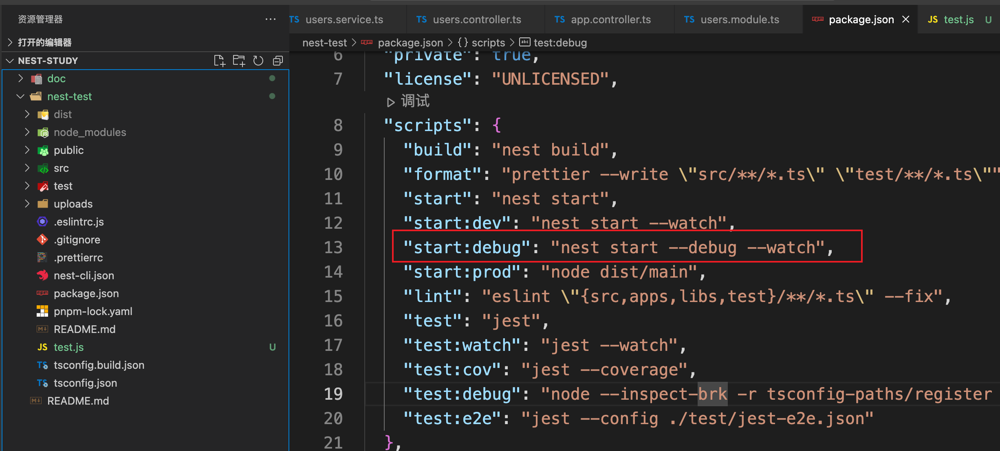

原理就是 node --inspect，但是 node --inspect 是不会自动断点的，所以需要在 代码中 debugger


但是，开发是在 vscode 中，这样利用浏览器调试过于麻烦，下面介绍利用 vscode 调试


### VSCode 调试 Nest


#### 零配置式

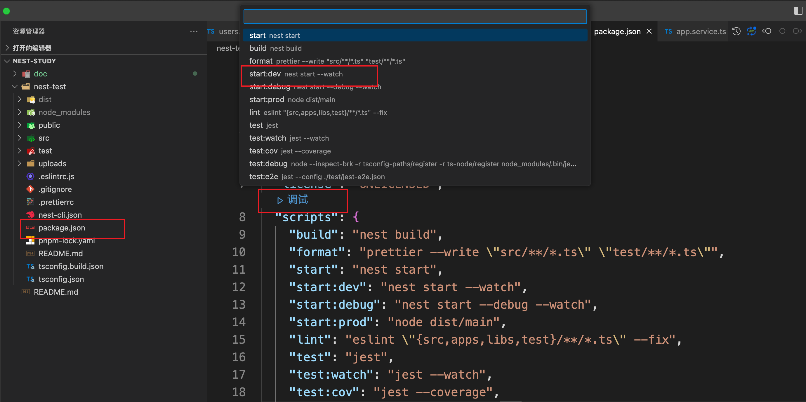


或者通过快捷命令 command + p，输入 debug ,(debug 后有空格)，选择 node

1、第一步

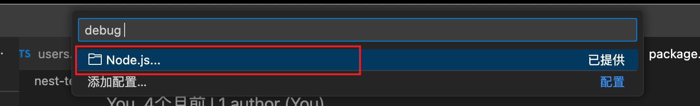

2、第二步

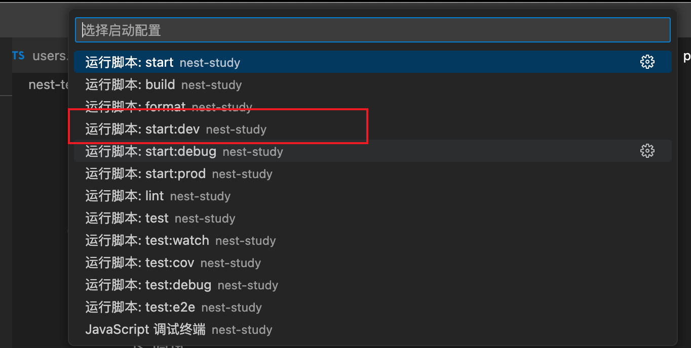


直接利用 vscode 现有能力，即可进行断点调试，但是这样可能不够灵活


#### 配置式

点击调试面板，创建 launch.json 

然后输入 node，快速创建一个 node 调试配置：

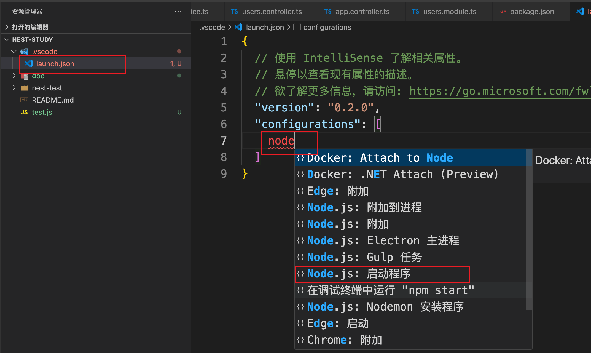


下面调试与 .vscode 同等级目录下的 test.js 文件

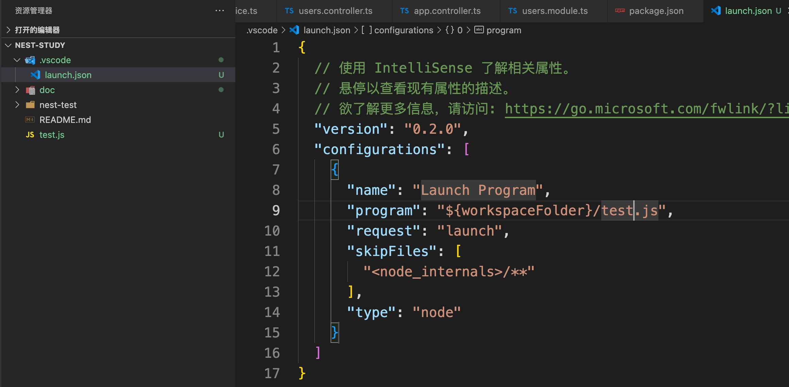


添加断点并点击启动，即可进行调试


