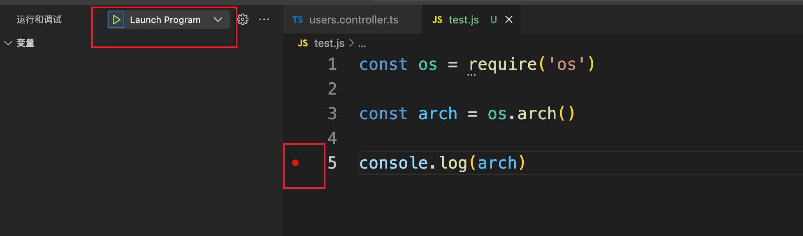
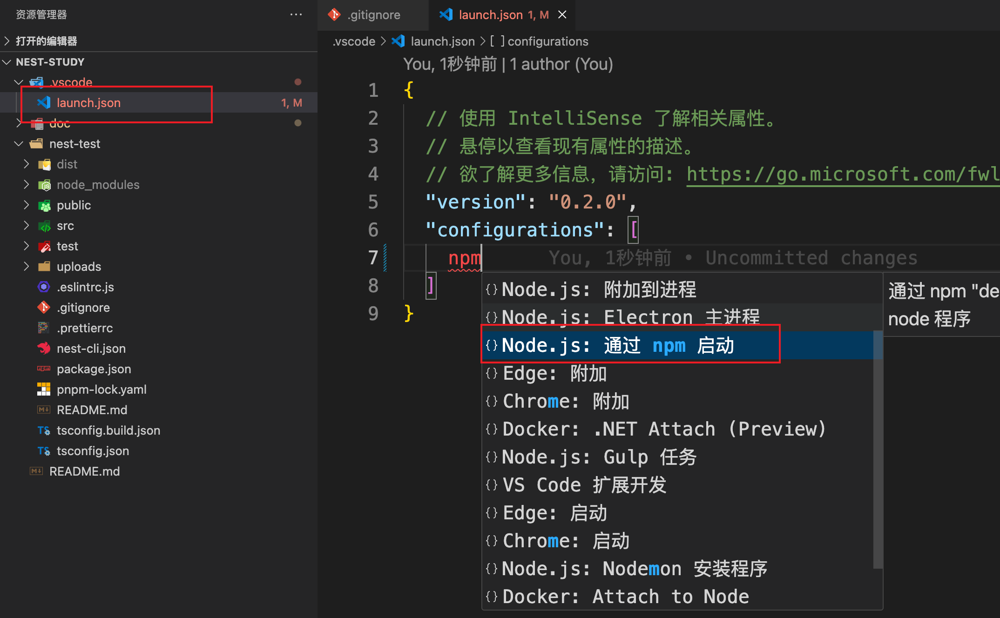
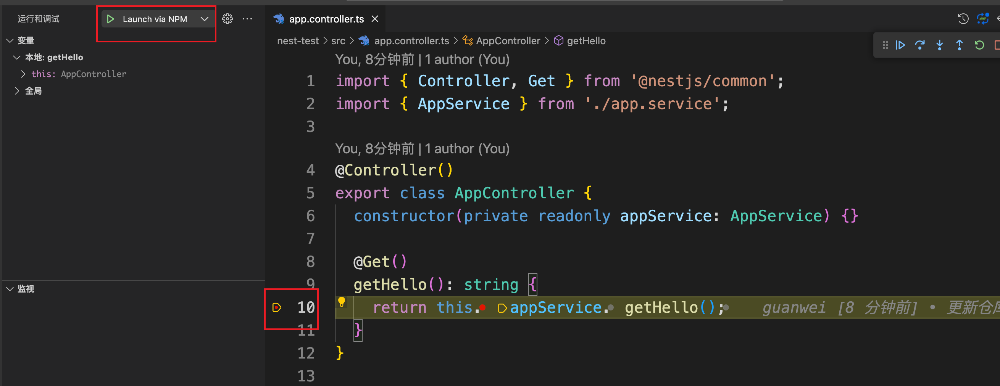
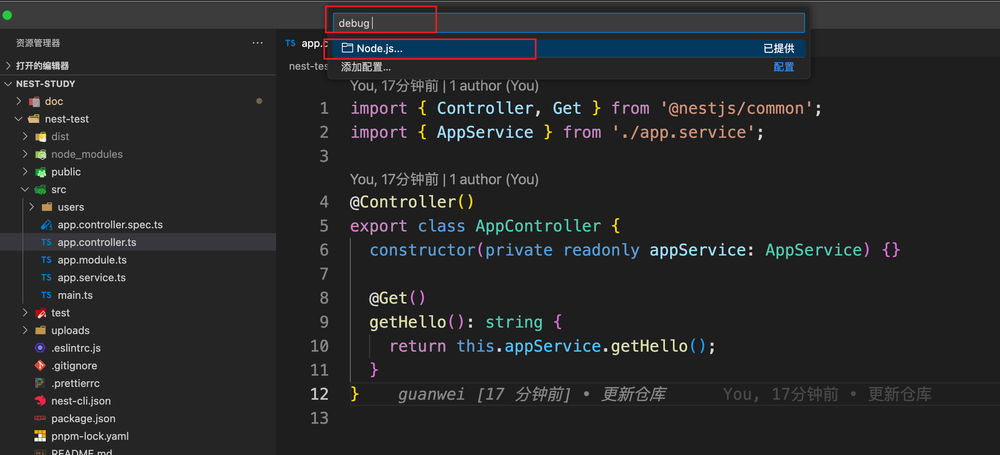
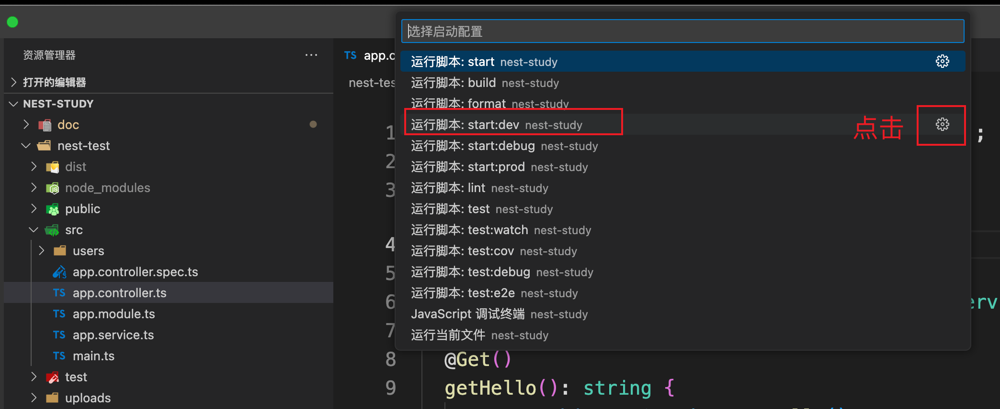
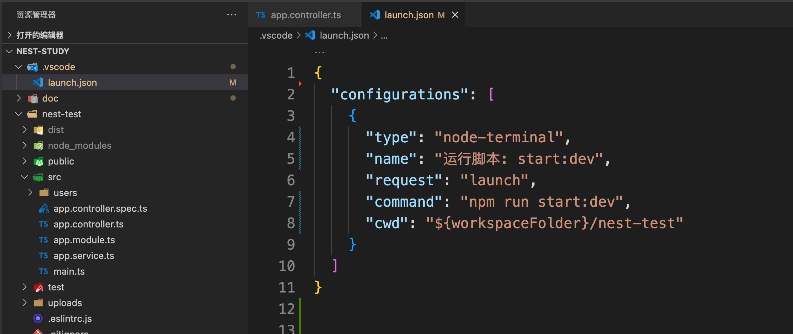

## Nest 的调试


### Node 调试

在学 Nest 调试之前,先看下 Node 调试

如下，有一段代码：

```js
const os = require('os')

const arch = os.arch()

console.log(arch)
```

通过 os 获取 CPU 架构，直接使用 node 执行，可以得到：


node 提供了调试模式运行：

- node --inspect：调试模式运行
- node --inspect-brk：调试模式运行，并在首行断点


这里使用：

```shell
node --inspect-brk ./test.js
```

可以看到，这是启动了一个 ws 服务


然后打开 [chrome://inspect/](https://link.juejin.cn/?target=)，可以看到可以调试的目标：


如果没看到 inspect，配置下 network targets，加上：加上 localhost:9229


然后点击 inspect 即可看到调试界面


nest 也是 node 项目，也可以 通过这种方式来调试，但是 nest 提供了 debug 命令


原理就是 node --inspect，但是 node --inspect 是不会自动断点的，所以需要在 代码中 debugger


但是，开发是在 vscode 中，这样利用浏览器调试过于麻烦，下面介绍利用 vscode 调试


### VSCode 调试 Nest


#### 零配置式


或者通过快捷命令 command + p，输入 debug ,(debug 后有空格)，选择 node

1、第一步


2、第二步


直接利用 vscode 现有能力，即可进行断点调试，但是这样可能不够灵活


#### 配置式

**调试Node**

点击调试面板，创建 launch.json 

然后输入 node，快速创建一个 node 调试配置：


下面调试与 .vscode 同等级目录下的 test.js 文件


添加断点并点击启动，即可进行调试




**通过配置 npm 命令调试 nest**

输入 npm




配置如下：

```json
{
  // 使用 IntelliSense 了解相关属性。 
  // 悬停以查看现有属性的描述。
  // 欲了解更多信息，请访问: https://go.microsoft.com/fwlink/?linkid=830387
  "version": "0.2.0",
  "configurations": [
    {
      "type": "node",
      "name": "Launch via NPM",
      "request": "launch",
      "runtimeExecutable": "npm",
      "runtimeArgs": [
        "run-script",
        "start:dev"                              // nest 通过这个参数启动
      ],
      "cwd": "${workspaceFolder}/nest-test",     // 如果.vscode 不在项目根目录，可以通过这个指定项目目录
      "skipFiles": [
        "<node_internals>/**"
      ],
      "console": "integratedTerminal"            // 指定使用vscode的终端输出日志
    }
  ]
}
```


然后启动调试，进行断点即可



**更快捷的方式**

Ctrl + p 打开 vscode 快捷面板，输入 debug + 空格




然后 选择：



 

可以快速通过 vscode 自动生成配置




